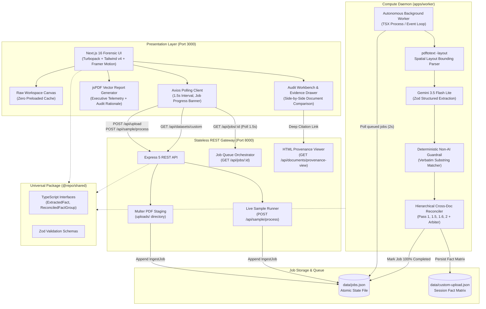
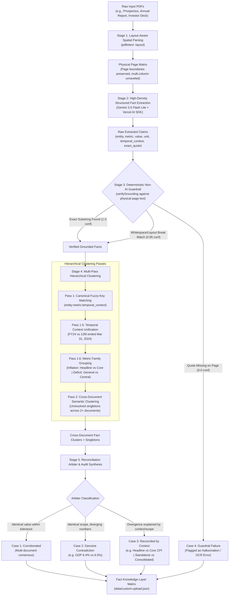
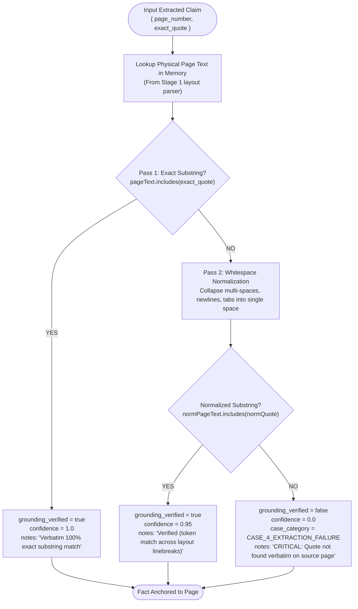
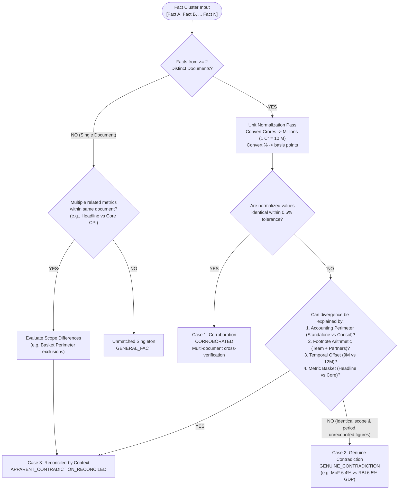

# SuperKnowledge: Architecture, Pipeline & Engineering Decisions

This document provides an in-depth technical analysis of SuperKnowledge's architecture, its multi-pass extraction and reconciliation pipeline, the deterministic non-AI grounding guardrail, and the foundational engineering decisions that shaped the system.

---

## 1. High-Level System Architecture

SuperKnowledge is organized as a decoupled **Turborepo Monorepo** separating concerns across type definitions, API ingestion, background compute, and forensic UI:

---

## 2. The 5-Pass Extraction & Reconciliation Pipeline

Standard RAG architectures fail on financial and macroeconomic reports because they retrieve isolated text chunks without extracting canonical units, time periods, or accounting scopes. SuperKnowledge employs a structured 5-pass extraction and reconciliation pipeline:

---

## 3. Deterministic Non-AI Grounding Guardrail Flowchart

AI-as-a-judge systems are unreliable for verifying factual claims because LLMs can hallucinate justifications. SuperKnowledge enforces an ironclad, zero-AI verification algorithm:

---

## 4. Cross-Document Reconciliation Arbiter Decision Tree

---

## 5. Architectural Decision Records (ADRs) & Engineering Rationale

### Decision 1: Decoupled Turborepo Monorepo vs. Monolithic Next.js
- **Context**: Next.js App Router supports route handlers (`/api/...`), but running heavy PDF layout parsing, LLM batching, and clustering inside a serverless or server-side rendering process causes severe memory pressure, thread-blocking, and request timeouts.
- **Decision**: Decouple into three distinct runtime layers:
  1. `apps/web`: Pure frontend presentation (Next.js 16 Turbopack).
  2. `apps/backend`: Lightweight, stateless REST API gateway (Express 5).
  3. `apps/worker`: Dedicated asynchronous compute daemon running on its own process.
- **Benefit**: Long-running ingestion jobs (processing 100+ pages) never block the UI or drop HTTP connections. The client polls job progress asynchronously via Axios.

### Decision 2: Deterministic Non-AI Guardrail vs. LLM-as-Judge
- **Context**: Many AI applications use a secondary LLM call to verify if an answer is truthful. However, LLMs suffer from self-reinforcing bias and can hallucinate confirmations of non-existent quotes.
- **Decision**: We use an entirely non-AI, algorithmic string matcher. We compare the model's reported `exact_quote` against the in-memory spatial text of `page_number` extracted by `pdftotext -layout`.
- **Benefit**: 100% mathematical certainty. If a model hallucinates a quote or gets a page number wrong, it fails instantly with confidence 0.0, completely preventing ungrounded claims from entering the corroborated fact set.

### Decision 3: Multi-Pass Hierarchical Clustering (Especially Pass 1.6 Metric Family)
- **Context**: In financial and macroeconomic filings, related metrics often have different names. For example, the Reserve Bank of India reports "Headline Inflation" at 4.6% and "Core Inflation" at 3.5%. Naive string matching treats them as unrelated singletons.
- **Decision**: We designed a 4-tiered clustering architecture:
  - **Pass 1**: Canonical key matching (`entity.metric.period`).
  - **Pass 1.5**: Temporal normalization (unifying `FY24` with `12M ended Mar 31, 2024`).
  - **Pass 1.6**: Deterministic metric family clustering (grouping `inflation`, `deficit`, `workforce`, `services_gva`, etc.).
  - **Pass 2**: Cross-document semantic LLM clustering for remaining edge cases.
- **Benefit**: Guarantees that related metrics cluster together so the reconciliation arbiter can evaluate contextual scope differences.

### Decision 4: Universal Default to Gemini 3.5 Flash Lite
- **Context**: Full-scale financial PDFs (Annual Reports, Economic Surveys) span hundreds of pages. Prompting heavy models like Gemini 3.5 Flash or Pro frequently hits free-tier rate limits (15 Requests Per Minute / 429 errors).
- **Decision**: Configure `gemini-3.5-flash-lite` as the primary default across the backend, worker, and frontend, backed by high-density chunking (8–12 pages per call).
- **Benefit**: Slashes extraction latency from minutes to under 40 seconds across 3 full institutional reports, while completely avoiding `429 RESOURCE_EXHAUSTED` quota limits.

### Decision 5: Client-Side Vector PDF Audit Report with Step-by-Step Rationale
- **Context**: Enterprise auditors and analysts require downloadable, printable, self-contained documentation of fact reconciliation.
- **Decision**: Built a vector PDF generation engine with `jsPDF` (`apps/web/lib/pdf-report.ts`). It generates multi-page reports featuring executive telemetry cards, source document verification tables, side-by-side evidence with verbatim quotes, and **Step-by-Step Audit Rationales** with structured disambiguation factors.
- **Benefit**: Exports with explicit `application/pdf` MIME type and `.pdf` extension, opening directly in the browser and saving locally without requiring server-side rendering dependencies (like Puppeteer).
