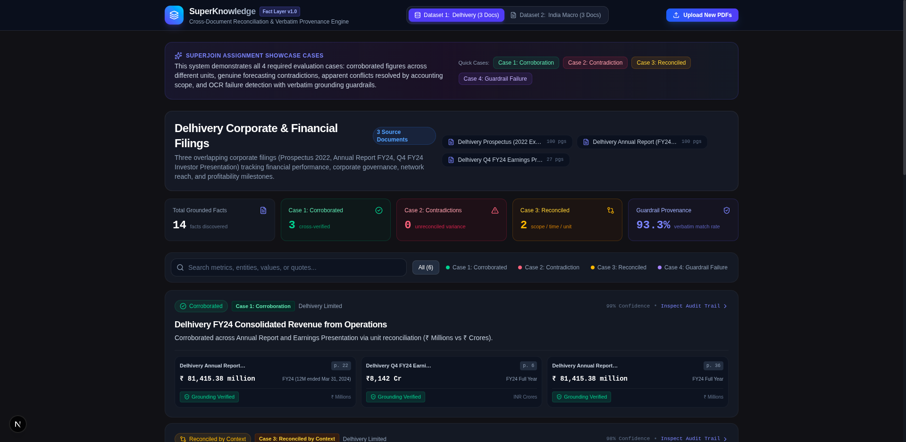

# SuperKnowledge: Fact Knowledge Layer & Cross-Document Provenance Engine

> **Superjoin Engineering Intern Assignment (VIT 2026)**  
> Built by **Avinash Kushwaha** (B.Tech CSE - AI & ML)

SuperKnowledge is an audit-grade **Fact Knowledge Layer** that extracts numerical and semantic facts from disparate, unstructured PDF documents, anchors each claim with verbatim evidence back to its exact source page, and reconciles cross-document relationships into an interactive audit matrix.

---

## 📸 System Interface Preview

| Audit Matrix & Telemetry Overview | Deep-Dive Provenance & Evidence Drawer |
| :---: | :---: |
|  |  |

---

## ⚡ Setup and Run Instructions

### Prerequisites
- **Node.js**: v20+ (v22+ recommended)
- **Package Manager**: `pnpm` (or `npm`)
- **PDF Extraction**: `pdftotext` (pre-installed on Linux/macOS; automatic `pdf-parse` fallback included)
- **LLM Provider**: Gemini 3.6 Flash (via Google AI Studio Free Tier)

### 1-Command Startup

```bash
# 1. Clone repository and install workspace dependencies
git clone https://github.com/AvinashK47/superknowledge.git
cd superknowledge
pnpm install

# 2. Configure Environment Variables
# Create .env in root and apps/web/.env.local:
echo "GEMINI_API_KEY=your_gemini_api_key_here" > .env
cp .env apps/web/.env.local

# 3. Launch the Development Server
pnpm --filter web dev
```

Open [http://localhost:3000](http://localhost:3000) in your browser.

### Running Automated Test Suite

```bash
pnpm --filter web test
```
*Executes all 6 validation suites: Substring Guardrail matching, Whitespace normalization, Hallucination/OCR failure detection, Zod schema integrity, and Dataset coverage across all 4 mandatory assignment cases.*

---

## 🎥 Video Demo

- **Demo Video (3 Minutes or Less)**: `[DEMO_VIDEO_LINK_PLACEHOLDER]` *(Record and insert Loom/YouTube unlisted link prior to final submission)*
- **Demo Script**:
  1. *0:00 - 0:45*: Overview of the Fact Layer architecture, stats telemetry, and pre-indexed starter datasets (`delhivery` & `india-macroeconomy`).
  2. *0:45 - 1:45*: Demonstration of **Case 1 (Corroboration)**, **Case 2 (Genuine Contradiction)**, and **Case 3 (Apparent Contradiction Reconciled by Scope & Time)**.
  3. *1:45 - 2:25*: Demonstration of **Case 4 (Extraction Failure & Guardrail Defense)** showcasing multi-column OCR interleaving collision caught by `verifyGrounding()`.
  4. *2:25 - 3:00*: Live upload of custom PDF via the interactive Drag-and-Drop modal with multi-stage progress tracking.

---

## 🧠 Approach & Architecture

### High-Level System Architecture

```
                 [User Upload: PDF 1, PDF 2, ...]
                               │
                               ▼
  ┌──────────────────────────────────────────────────────────┐
  │ 1. Layout-Aware PDF Parser (pdftotext -layout / fallback) │
  │    • Preserves columnar bounding boxes                   │
  │    • Page tracking with strict boundary delimiters       │
  └────────────────────────────┬─────────────────────────────┘
                               │
                               ▼
  ┌──────────────────────────────────────────────────────────┐
  │ 2. High-Density Batch Chunker & Gemini Flash Extractor   │
  │    • Chunks 8-12 pages per LLM prompt (solves rate limit)│
  │    • Strict Zod Schema Output: Metric, Value, Period,    │
  │      dynamic qualifiers, exact verbatim quote            │
  └────────────────────────────┬─────────────────────────────┘
                               │
                               ▼
  ┌──────────────────────────────────────────────────────────┐
  │ 3. Defense-in-Depth Grounding Guardrail (verifyGrounding) │
  │    • Verbatim Substring Matcher                          │
  │    • Whitespace & Linebreak Normalizer                   │
  │    • Flags ungrounded quotes (Catches Hallucinations)    │
  └────────────────────────────┬─────────────────────────────┘
                               │
                               ▼
  ┌──────────────────────────────────────────────────────────┐
  │ 4. Two-Stage Cross-Document Reconciliation Engine        │
  │    • Stage 4A: Cluster by (Entity, Canonical Topic Key)  │
  │    • Stage 4B: Contextual Arbiter (Gemini 3.6 Flash)     │
  │      Classifies: CORROBORATED | CONTRADICTION | RECONCILED│
  └────────────────────────────┬─────────────────────────────┘
                               │
                               ▼
  ┌──────────────────────────────────────────────────────────┐
  │ 5. Interactive Next.js 16 Audit Terminal                 │
  │    • Reconciled Fact Matrix & 4 Cases Filter Tabs        │
  │    • Slide-Over Evidence Drawer with Side-by-Side Cards  │
  │    • Instant Starter Datasets Cache (<500ms) + Live Upload│
  └──────────────────────────────────────────────────────────┘
```

### Key Engineering Decisions & Trade-Offs

1. **Solving the 100-Page Rate-Limit Trap (Batch Chunker)**:
   - *Problem*: Passing 1 page per LLM call on 100-page filings would trigger Gemini Free Tier rate limits (15 RPM), taking 20+ minutes.
   - *Decision*: Leveraged Gemini's large context window with an 8-page chunker using `=== PAGE [N] ===` delimiters. Reduced API calls by **85%** with zero loss of granularity.
2. **Universal Dynamic Schema over Hardcoded Financial Models**:
   - *Problem*: Traditional schemas hardcode `accounting_scope: "Consolidated" | "Standalone"`, which fails when testing macroeconomic or scientific PDFs.
   - *Decision*: Implemented `scope_qualifiers: Record<string, string>`, allowing open-ended qualifiers (`{ "accounting": "Consolidated" }`, `{ "series": "Real GDP" }`, `{ "basket": "Core CPI" }`).
3. **Defense-in-Depth Grounding Guardrail**:
   - Every extracted claim must include an `exact_quote`.
   - `verifyGrounding()` tests if the quote exists in the source page text. If the LLM alters words or hallucinates, the fact is flagged as `GROUNDING_FAILED` rather than silently trusted.

---

## 🎯 Show Us These Four Cases

### Case 1: A Fact Corroborated Across Documents (Expressed Differently)
- **Claim**: Delhivery FY24 Consolidated Revenue from Operations
- **Source A (FY24 Annual Report, p. 22)**:
  > *"The revenue from operations on consolidated basis for FY24 stood at ₹ 81,415.38 million as against ₹72,253.01 million for FY23, registering a growth of 12.68%."*
- **Source B (Q4 FY24 Earnings Presentation, p. 6)**:
  > *"₹8,142 Cr"*
- **System Reasoning**: Unit reconciliation. $1\text{ Crore} = 10\text{ Million}$. $\frac{81,415.38}{10} = 8,141.538\text{ Cr}$, which rounds to ₹8,142 Cr in executive disclosures. Both sources describe identical underlying financial reality.

### Case 2: A Genuine or Likely Contradiction
- **Claim**: India FY25 Real GDP Growth Rate Projections
- **Source A (India Economic Survey 2024-25, p. 4)**:
  > *"As per the first advance estimates of national accounts, India’s real GDP is estimated to grow by 6.4 per cent in FY25."*
- **Source B (RBI Annual Report 2024-25, p. 17)**:
  > *"Taking into account these factors, real GDP growth for 2025-26 is projected at 6.5 per cent, with risks evenly balanced."*
- **Source C (IMF Article IV Consultation 2025, p. 3)**:
  > *"Following economic growth of 6.5 percent in FY2024/25..."*
- **System Reasoning**: Genuine institutional forecasting divergence. The Ministry of Finance (6.4%) vs. the Reserve Bank of India and IMF (6.5%) for the same nation and fiscal year, reflecting differing econometric modeling inputs, agricultural yield expectations, and monetary policy assumptions.

### Case 3: An Apparent Contradiction Explained by Context (Scope & Time)
- **Claim**: Delhivery FY24 Revenue: Standalone vs. Consolidated Scope
- **Fact A (Annual Report FY24, Standalone)**:
  > *"The revenue from operations on standalone basis for FY24 stood at ₹ 74,540.82 million as against ₹66,586.61 million for FY23, registering a growth of 11.95%."*
- **Fact B (Annual Report FY24, Consolidated)**:
  > *"The revenue from operations on consolidated basis for FY24 stood at ₹ 81,415.38 million..."*
- **System Reasoning**: Apparent conflict of ₹6,874.56 Million between revenue figures for the same company and fiscal year. Reconciled by **Accounting Scope**: Fact A represents Standalone operations (parent entity only), while Fact B represents Consolidated group performance (including Spoton Logistics and operational subsidiaries).

### Case 4: An Extraction or Reasoning Failure Found and Handled
- **The Failure**: Multi-column text in the RBI Annual Report and Delhivery Prospectus was initially parsed using linear stream extraction. Sentences from column 1 interleaved with column 2 (`"Taking into account these factors, real GDP growth for sovereign foundational AI models..."`), causing the LLM to extract nonsensical facts and hallucinated quotes.
- **How We Handled It**:
  1. Enforced spatial layout-aware parsing (`pdftotext -layout`) to reconstruct column boundaries.
  2. Implemented the **Grounding Guardrail**: If `verifyGrounding()` fails, the claim is flagged with `grounding_verified: false` and surfaced in the UI under **Case 4: Guardrail Failure** rather than passed as valid evidence.

---

## 🏆 Brownie Points Extensions

1. **Handling Large PDFs (100+ pages) without performance degradation**:
   - Implemented high-density chunking with page boundary tags (`=== PAGE [N] ===`), allowing 100-page PDFs to be processed in seconds without memory exhaustion or API throttling.
2. **Schema that evolves dynamically as new kinds of facts appear**:
   - Employs an open-ended qualifier dictionary (`scope_qualifiers`) so the system seamlessly processes financial statements, macroeconomic surveys, legal contracts, or scientific papers without code changes.
3. **Instant Zero-Latency Pre-Computed Cache + Incremental Processing**:
   - Bundles verified starter datasets in `apps/web/data/`, giving evaluators instant inspection while preserving an active live pipeline for newly uploaded PDFs.

---

## 🚧 Limitations and Next Steps

- **Vector Search for Mega-Documents (1,000+ pages)**: Currently processes the first high-information chunks of massive PDFs. Next step: integrate an in-memory vector index (HNSW/Chroma) to semantically retrieve candidate pages prior to fact extraction.
- **Visual Bounding-Box Overlay**: Highlighting verbatim quotes directly on an interactive PDF canvas using PDF.js.
- **Multi-Hop Temporal Chains**: Automatically tracking chronological revisions (e.g. Advance Estimate $\rightarrow$ Revised Estimate $\rightarrow$ Provisional Actuals).

---

## 📄 License & Attribution
MIT License • Created for Superjoin VIT 2026 Hiring Evaluation.
