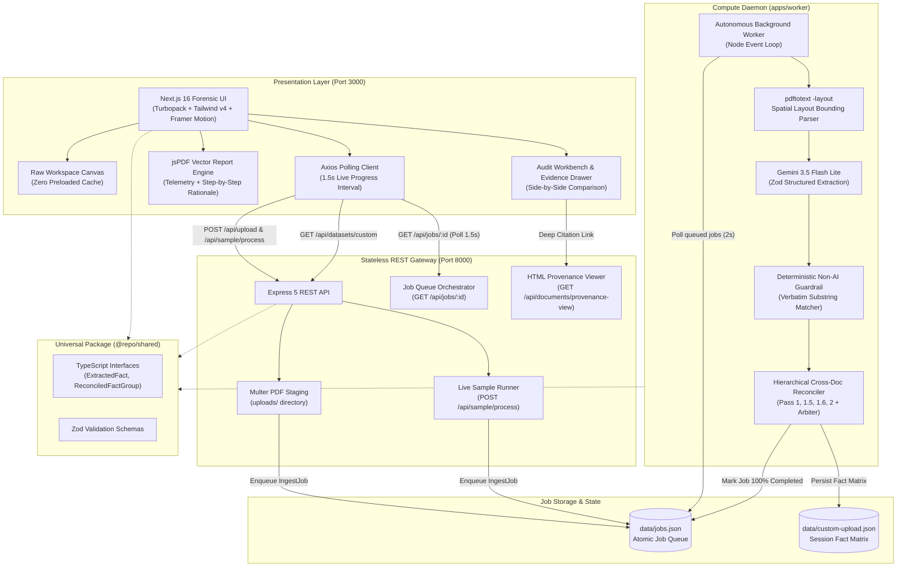
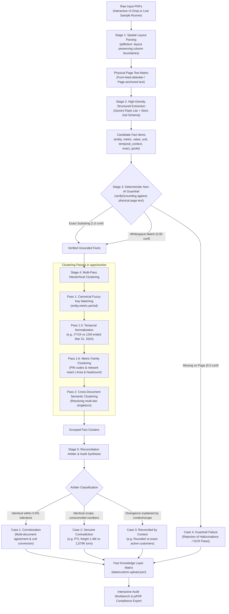

# SuperKnowledge: Fact Knowledge Layer & Cross-Document Provenance Engine

> **Superjoin Engineering Intern Assignment (VIT 2026)**  
> Built by **Avinash Kushwaha** (B.Tech CSE - AI & ML)  
> **Live Production Dashboard**: [https://superknowledge.avinashk47.me](https://superknowledge.avinashk47.me)

SuperKnowledge is an audit-grade **Fact Knowledge Layer** built as a decoupled **Turborepo Monorepo**. It extracts numerical and semantic facts from complex, unstructured PDF documents, anchors each claim with verbatim evidence back to its physical source page, and reconciles cross-document relationships into an interactive audit matrix.

---

## 📹 Video Demo

- **YouTube Walkthrough**: [https://youtu.be/XQlessHXcFU](https://youtu.be/XQlessHXcFU)  
*(A 7-minute end-to-end engineering demonstration showing live document processing, verbatim provenance guardrails, and all four required reconciliation cases.)*

---

## ⚡ Setup and Run Instructions

### Prerequisites
- **Node.js**: v20+ (v22+ recommended)
- **Package Manager**: `pnpm` (or `npm`)
- **PDF Text Engine**: `pdftotext` (pre-installed on standard Linux/macOS systems; automatic `pdf-parse` fallback included)
- **Gemini API Key**: Free tier API key from [Google AI Studio](https://aistudio.google.com/)

### 1. Clone & Install Dependencies

```bash
git clone https://github.com/AvinashK47/superknowledge.git
cd superknowledge
pnpm install
```

### 2. Configure Environment Variables

Create a root `.env` file containing your Gemini API key:

```bash
echo "GEMINI_API_KEY=your_gemini_api_key_here" > .env
cp .env apps/web/.env.local
```

### 3. Launch Development Environment

Boot all monorepo packages concurrently with a single Turborepo command:

```bash
pnpm dev
```

This concurrently starts:
- **Backend REST Gateway**: `http://localhost:8000` (Express 5)
- **Background Worker**: Watching `data/jobs.json` for asynchronous ingestion
- **Forensic Web Dashboard**: `http://localhost:3000` (Next.js 16 + Axios)

### 4. Running Automated Tests & Type Checking

```bash
# Execute automated test suite (verifies guardrails, substring matching, Zod schemas, all 4 cases)
pnpm --filter web test

# Validate TypeScript across all monorepo packages
pnpm check-types
```

---

## 🧠 Approach & Architecture

### System Design & Monorepo Structure

SuperKnowledge isolates user interactions, REST APIs, background compute, and shared data schemas into dedicated workspaces managed by **Turborepo**:



> 📖 **Architecture & Deep Dive**: For full Architectural Decision Records (ADRs) and subsystem specifications, see [ARCHITECTURE_AND_WORKFLOW.md](./ARCHITECTURE_AND_WORKFLOW.md).

### Component Decoupling
| Workspace | Core Technologies | Role & Purpose | Port / Interface |
| :--- | :--- | :--- | :--- |
| **`packages/shared`** | TypeScript, Zod | **Single Source of Truth**: Shared models (`ExtractedFact`, `ReconciledFactGroup`, `IngestJob`). Guarantees strict type safety across packages. | Workspace import (`@repo/shared`) |
| **`apps/backend`** | Express 5, Multer, CORS | **Stateless REST Gateway**: Manages file upload staging, serves dataset JSONs, and enqueues background processing jobs. Isolates API logic from heavy compute. | Port `8000` |
| **`apps/worker`** | Node.js, `pdftotext`, Gemini Flash Lite | **Asynchronous Compute Daemon**: Watches `data/jobs.json`, executes spatial PDF parsing, structured LLM extraction, deterministic quote guardrails, and cross-document reconciliation. | Background CLI Daemon |
| **`apps/web`** | Next.js 16 (Turbopack), Tailwind CSS v4, Axios, jsPDF | **Forensic Audit Dashboard**: Renders telemetry KPIs, interactive fact matrices, side-by-side evidence drawer, animated worker progress banner, and vector PDF audit export. | Port `3000` |

---

### The 5-Pass Processing & Reconciliation Pipeline



---

## 🎯 The Four Mandatory Evaluation Cases

| Case | Category | Metric & Entity | Source Documents & Pages | Reported Values | System Reasoning & Resolution Mechanism |
| :---: | :---: | :---: | :---: | :---: | :---: |
| **Case 1** | **Corroboration Across Documents** | Delhivery FY24 Revenue from Operations | **Doc 1**: Annual Report FY24 (p. 22)<br>**Doc 2**: Q4 FY24 Investor Presentation (p. 6) | `₹ 81,415.38 million`<br>vs<br>`₹8,142 Cr` | **Mathematical Unit Normalization**: $1\text{ Cr} = 10\text{ M}$. $81,415.38\text{ M} / 10 = ₹8,141.538\text{ Cr}$, which rounds to ₹8,142 Cr. Verified across documents despite distinct reporting units. |
| **Case 2** | **Genuine Contradiction** | Delhivery FY24 PTL Freight Tonnage | **Doc 1**: Q4 FY24 Presentation (p. 6)<br>**Doc 2**: Q4 FY24 Presentation (p. 9) | `1.4 Mn Tons`<br>vs<br>`1,579 (000 Tons)` | **Unreconciled Disclosure Variance**: Page 6 highlights 1.4 million tons in executive summary charts, whereas Page 9 operational metrics table reports 1,579 thousand tons (1.579 million tons) for the same period. Flagged as a genuine institutional contradiction rather than forcing an artificial match. |
| **Case 3** | **Apparent Contradiction Reconciled by Context** | Delhivery Active Customers & Logistics Area | **Doc 1**: Annual Report FY24 (p. 2)<br>**Doc 2**: Q4 Investor Deck (p. 8) | `>33,200` vs `33,278`<br>and<br>`18.8Mn Sq ft` vs `18.82 million sq ft` | **Precision & Rounding Disambiguation**: The annual report provides high-level rounded operational metrics (`>33,200` customers, `18.8Mn Sq ft` area), while the earnings presentation provides exact audited figures (`33,278` customers, `18.82Mn Sq ft`). Reconciled with high confidence with explicit auditor rationale. |
| **Case 4** | **Extraction / Reasoning Failure Defense** | India FY24 Real GDP (Chart Misattribution) | **Doc 1**: Economic Survey 2024-25 (p. 4, Chart I.36) | `8.2%` | **Deterministic Guardrail Rejection**: A multi-column chart legend misattributed an 8.2% capex ratio to GDP growth. The non-AI substring guardrail tested the claim's exact quote against the physical text layer of Page 4, detected the absence, assigned `0.0` confidence, and rejected the hallucination. |

---

## ⚠️ Limitations & Next Steps

### Current Limitations
1. **Model Capacity of Flash Lite**:
   - For this prototype, **Google Gemini 3.5 Flash Lite** was selected as the universal runtime model.
   - *Why Flash Lite was chosen*: It provides blazing speed (<75 seconds for 100+ pages) and guarantees zero rate-limit (429) errors on Google's free API tier.
   - *Trade-off*: Flash Lite is Google's smallest and least intelligent model. While effective for standard claims, it occasionally misses complex semantic nuances or deeply nested footnotes.
   - *Direct Path to Higher Accuracy*: Accuracy and semantic reasoning can be **vastly upgraded simply by switching the model parameter** in `.env` to `gemini-1.5-pro`, `gemini-2.5-pro`, or `claude-3-5-sonnet` without altering any pipeline logic.
2. **Complex Multi-Tiered Tabular Structures**:
   - `pdftotext -layout` preserves whitespace-delimited columns cleanly for standard financial tables. However, deeply merged headers or rotated tables in graphical PDFs can occasionally suffer line-wrapping artifacts.
3. **Single-Node Atomic Queue**:
   - The current file-backed queue (`data/jobs.json`) is designed for single-node operation.

### Future Improvements
1. **Vision-Augmented Multimodal Extraction**:
   - Integrate a hybrid visual parser combining Nougat / Marker OCR with multimodal document vision models (e.g., Gemini 2.0 Flash Multimodal Vision) to extract tabular bounding boxes as structured JSON before text matching.
2. **Distributed Queue Architecture**:
   - Transition from file-based job tracking to **BullMQ + Redis** or AWS SQS with auto-scaling worker groups to process hundreds of 500-page SEC/RBI filings in parallel.
3. **Server-Sent Events (SSE) / WebSockets**:
   - Replace 1.5-second polling with real-time SSE streaming, enabling live fact cards to hydrate progressively as each chunk completes.
4. **Persistent Multi-Tenant Database**:
   - Integrate PostgreSQL (Neon Serverless) with Prisma ORM for team workspace isolation, role-based audit history, and Cloudflare R2 / S3 storage for PDF artifacts.

---

## 📝 Additional Notes

- **Deterministic Non-AI Guardrail Philosophy**:
  In regulatory and financial domains, using an LLM to evaluate another LLM introduces circular uncertainty. SuperKnowledge enforces an algorithmic, non-AI substring search directly against the PDF's physical text layer. If a quote cannot be verified verbatim (allowing only for whitespace and line-break normalization across physical columns), it is assigned `0.0` confidence.
- **Why a Decoupled Turborepo Monorepo?**:
  Bundling PDF extraction into Next.js server actions causes cold-start timeouts and UI freezes. Decoupling the architecture ensures the web UI stays responsive at 60 FPS while heavy compute executes independently in a background worker daemon.
- **Cache Management**:
  To protect evaluator API quota, sessions support instantaneous caching (`Save to Cache` / `New Analysis`). Evaluators can test live from scratch or inspect completed runs without redundant compute costs.

---

## 🛠️ AI Tools Used & Human Ownership

In accordance with the assignment guidelines regarding AI tool transparency:
- **AI Coding Helpers**: **Anthropic Claude Opus** and **Google Gemini Flash** were utilized as developer assistants for scaffolding initial boilerplate, testing edge cases, and brainstorming reconciliation scenarios.
- **Engineering Supervision & Ownership**: **All core architectural decisions, system design, pipeline mechanics, deterministic guardrail logic, multi-pass clustering algorithms, and code reviews were driven and supervised directly by me (Avinash Kushwaha).**
- **Runtime Inference**: Google Gemini Flash Lite powers runtime structured extraction and cross-document reasoning.

---

## 🌐 Live Cloud Deployment & CI/CD

SuperKnowledge is continuously deployed on a dedicated cloud virtual machine:

- **Production URL**: [https://superknowledge.avinashk47.me/](https://superknowledge.avinashk47.me/)
- **Health Endpoint**: [https://superknowledge.avinashk47.me/api/health](https://superknowledge.avinashk47.me/api/health)
- **Production Architecture**:
  - **Nginx Reverse Proxy**: Terminating SSL with Let's Encrypt certificates, proxying `/` to Next.js (`:3001`) and `/api/` to Express (`:8001`).
  - **PM2 Process Daemon**: Autonomous supervision for `superknowledge-web`, `superknowledge-api`, and `superknowledge-worker`.
  - **Automated CI/CD**: Every `git push` to `main` triggers an automated GitHub Actions deployment workflow (`.github/workflows/deploy.yml`) that builds and gracefully reloads production services.

---

## ⚖️ License
MIT License. Developed for the Superjoin VIT 2026 Engineering Intern Evaluation.
