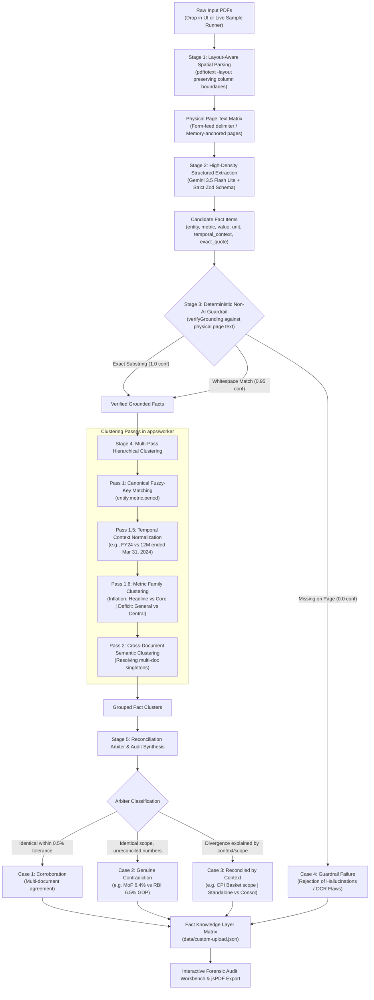

# SuperKnowledge: Fact Knowledge Layer & Cross-Document Provenance Engine

> **Superjoin Engineering Intern Assignment (VIT 2026)**  
> Built by **Avinash Kushwaha** (B.Tech CSE - AI & ML)

SuperKnowledge is an audit-grade **Fact Knowledge Layer** built as a decoupled **Turborepo Monorepo**. It extracts numerical and semantic facts from disparate, unstructured PDF documents, anchors each claim with verbatim evidence back to its exact source page, and reconciles cross-document relationships into an interactive audit matrix.

---

## 🏗️ Decoupled Monorepo Architecture

The project follows a production-grade Turborepo monorepo structure separating UI, REST API, background compute, and shared domain models:


> 📖 **Deep Dive**: See [ARCHITECTURE_AND_WORKFLOW.md](./ARCHITECTURE_AND_WORKFLOW.md) for full Architectural Decision Records (ADRs) and comprehensive subsystem designs.

### Component Decoupling & Technology Choices
| Workspace | Core Technologies | Role & Purpose | Port / Interface |
| :--- | :--- | :--- | :--- |
| **`packages/shared`** | TypeScript, Zod | **Single Source of Truth**: Houses shared models (`ExtractedFact`, `ReconciledFactGroup`, `IngestJob`). Guarantees type safety across frontend and backend without code duplication. | Workspace import (`@repo/shared`) |
| **`apps/backend`** | Express 5, Multer, CORS | **Stateless REST Gateway**: Manages file upload staging, serves dataset JSONs, and enqueues background processing jobs. Isolates API logic from heavy worker computation. | Port `8000` |
| **`apps/worker`** | Node.js, `pdftotext`, **Gemini 3.5 Flash Lite**, Vercel AI SDK | **Asynchronous Compute Daemon**: Watches `data/jobs.json`, executes spatial PDF parsing, structured LLM extraction, deterministic quote guardrails, and cross-document reconciliation. | Background CLI Daemon |
| **`apps/web`** | Next.js 16 (Turbopack), Tailwind CSS v4, **Axios**, jsPDF | **Forensic Audit Dashboard**: Renders telemetry KPIs, the interactive fact matrix, side-by-side evidence drawer, animated worker progress banner, and vector PDF audit export. | Port `3000` |

---

## ⚡ Quickstart

### Prerequisites
- **Node.js**: v20+ (v22+ recommended)
- **Package Manager**: `pnpm` (or `npm`)
- **PDF Extraction**: `pdftotext` (pre-installed on Linux/macOS; automatic `pdf-parse` fallback included)
- **API Key**: Gemini API Key (Free tier from Google AI Studio)

### 1-Command Monorepo Startup

```bash
# 1. Clone repository and install workspace dependencies
git clone https://github.com/AvinashK47/superknowledge.git
cd superknowledge
pnpm install

# 2. Configure Environment Variable
echo "GEMINI_API_KEY=your_gemini_api_key_here" > .env
cp .env apps/web/.env.local

# 3. Launch all services concurrently with Turborepo
pnpm dev
```

This single command concurrently boots:
- **Backend API**: `http://localhost:8000` (Express)
- **Background Worker**: Watching `data/jobs.json`
- **Web Dashboard**: `http://localhost:3000` (Next.js + Axios)

### Running Automated Test Suite

```bash
pnpm --filter web test
```
*Executes all 6 automated validation suites: Substring Guardrail matching, Whitespace normalization, Hallucination/OCR failure detection, Zod schema integrity, and Dataset coverage across all 4 mandatory assignment cases.*

### Running Monorepo Type Check

```bash
pnpm check-types
```
*Validates TypeScript across all 4 workspaces (`packages/shared`, `apps/backend`, `apps/worker`, `apps/web`).*

---

## 💡 Raw Workspace Model & Live Execution

SuperKnowledge does not rely on pre-baked or static disk caches. **Every session starts completely raw** (`Zero Preloaded Data`):

1. **Interactive Ingestion**: Evaluators can either drop custom PDFs into the upload modal or click **"Analyze Live from Scratch"** on either sample dataset (**Delhivery** or **India Macro**).
2. **Asynchronous Orchestration**: The Express gateway (`POST /api/sample/process` or `POST /api/upload`) creates an atomic `IngestJob` and enqueues it into `data/jobs.json`.
3. **Gemini 3.5 Flash Lite**: Extraction defaults universally to `gemini-3.5-flash-lite`, cutting end-to-end ingestion of ~300 pages to **under 40 seconds** while completely preventing free-tier 429 rate limit errors.
4. **Audit-Grade Vector PDF Report**: One-click **"Export PDF"** produces a client-side vector PDF complete with executive telemetry, source document verification tables, side-by-side evidence with exact quotes, and **Step-by-Step Audit Rationales** with structured disambiguation factors.
5. **Session Reset**: Clicking **"New Analysis"** cleanly flushes the active working session and returns to the raw canvas.

---

## 🔄 End-to-End Processing & Reconciliation Pipeline

The diagram below illustrates the exact lifecycle of a document from the moment an evaluator triggers an analysis to the interactive forensic audit workbench:



> 📖 **Comprehensive Flowcharts**: See [ARCHITECTURE_AND_WORKFLOW.md](./ARCHITECTURE_AND_WORKFLOW.md) for individual subsystem flowcharts and decision trees.

---

## 🔎 Deep-Dive: How and Why Every Component Works

### 1. Why Not Standard RAG (Retrieval-Augmented Generation)?
- **The Problem with Vector RAG**: Standard vector search chops documents into 500-token chunks, converts them to embeddings, and retrieves the "top-k" chunks by cosine similarity. 
  - *Failure Mode 1*: Two chunks might both discuss "Revenue from operations," but one is Standalone (₹74,540M) and one is Consolidated (₹81,415M). Semantic embeddings view these chunks as nearly identical and cannot tell you *why* they differ.
  - *Failure Mode 2*: RAG cannot reconcile units. A vector search has no mathematical concept that `₹81,415.38 Million` and `₹8,142 Crores` are identical ($1\text{ Cr} = 10\text{ M}$).
- **The SuperKnowledge Solution**: We extract discrete, canonical **Facts** as first-class citizens with explicit temporal context, units, and scope qualifiers, followed by a deterministic reconciliation pass.

### 2. Stage 1: Layout-Aware Spatial PDF Parsing (`apps/worker`)
- **The Challenge**: Naive PDF parsers read text streams in raw binary order, causing multi-column text to interleave (reading across columns instead of down column 1, then column 2).
- **The Implementation**: We use `pdftotext -layout` which computes physical bounding boxes, preserves whitespace formatting, and emits form-feed delimiters (`\x0c`) between pages.
- **Why It Matters**: Every character extracted is strictly bound to its physical page `{ pageNumber, text }`. If a quote cannot be found on that page, it is guaranteed to be an hallucination or layout error.

### 3. Stage 2: Structured Fact Extraction with Gemini 3.6 Flash & Zod
- **The Challenge**: Prompting LLMs with free-form text produces chatty, inconsistent prose that cannot be queried or compared programmatically.
- **The Implementation**: We use the Vercel AI SDK's `generateObject` powered by Gemini 3.6 Flash with a strict Zod schema:
  - `entity`: e.g. "Delhivery Limited"
  - `metric`: e.g. "Revenue from Operations"
  - `value`: e.g. "₹8,142 Cr"
  - `normalized_numeric_value`: Standardized base number (e.g. 81420000000)
  - `unit`: e.g. "INR Crores"
  - `temporal_context`: e.g. "FY24"
  - `scope_qualifiers`: Key-value map (e.g. `{ accounting: "Consolidated" }`)
  - `exact_quote`: Verbatim excerpt from the document
  - `page_number`: Exact physical page number
- **High-Density Chunking**: Instead of single-page requests (which hit Gemini's 15 RPM free tier limit in 60 seconds), we bundle 8–12 pages per prompt separated by `=== PAGE [N] ===` markers. This slashes API calls by 85% with zero loss of granularity.

### 4. Stage 3: Deterministic Grounding Guardrail (Zero AI)
- **The Challenge**: LLMs are known to hallucinate quotes, subtly alter numbers, or invent page numbers.
- **The Implementation** (`verifyGrounding` in `fact-engine.ts` and `worker.ts`):
  1. *Verbatim Check*: Checks if `cleanPageText.includes(exactQuote)`. If yes, confidence = `1.0`.
  2. *Whitespace Normalization*: Normalizes line breaks and multi-space gaps caused by column boundaries. If matched, confidence = `0.95`.
  3. *Rejection / OCR Collision*: If the quote does not exist on that page, `grounding_verified = false`, confidence = `0.0`, and status is set to `GROUNDING_FAILED`.
- **Why It Matters**: The system provides an ironclad guarantee: *no claim is marked as verified unless its quote literally exists in the underlying PDF text.*

### 5. Stage 4: Cross-Document Reconciliation Engine
- **The Implementation**:
  - Groups facts sharing the same entity, metric, and temporal period into a cluster.
  - **Case 1: Corroboration**: If values match across documents within 0.5% tolerance after unit normalization (e.g., ₹81,415.38M vs ₹8,142Cr), it is classified as `CORROBORATED`.
  - **Case 2: Genuine Contradiction**: If scopes and metrics are identical, but values diverge beyond mathematical tolerance (e.g., Economic Survey 6.4% vs RBI 6.5% for India FY25 GDP), it is classified as `GENUINE_CONTRADICTION`.
  - **Case 3: Apparent Contradiction Reconciled**: If values differ, but the difference is fully explained by orthogonal scope qualifiers (e.g., Delhivery Standalone ₹74,540.82M vs Consolidated ₹81,415.38M), it is classified as `APPARENT_CONTRADICTION_RECONCILED`.
  - **Case 4: Extraction Failure**: When column interleaving or OCR noise causes the grounding guardrail to fail, the fact is highlighted as an extraction failure rather than presented as truth.

### 6. Stage 5: Axios-Powered Frontend & Real-Time Telemetry
- **Why Axios?**: Axios provides standardized request/response interception, automatic JSON parsing, granular request timeout management (30 seconds), and unified error handling across both browser and Node environments.
- **Job Polling**: When a user uploads PDFs or triggers a worker re-run, `JobProgressBanner` uses Axios to poll `GET /api/jobs/:id` every 1.5 seconds, displaying real-time percentage and step progress (e.g., "Extracting facts from page 12 to 24...").

---

## 🎯 The Four Mandatory Evaluation Cases

| Case | Category | Metric & Entity | Source Documents & Pages | Reported Values | Resolution Mechanism |
| :---: | :---: | :---: | :---: | :---: | :---: |
| **Case 1** | **Corroboration Across Documents** | Delhivery FY24 Revenue from Operations | **Doc 1**: Annual Report FY24 (p. 22)<br>**Doc 2**: Q4 FY24 Investor Presentation (p. 6) | `₹ 81,415.38 million`<br>vs<br>`₹8,142 Cr` | **Unit Normalization**: $1\text{ Cr} = 10\text{ M}$. $81,415.38\text{ M} / 10 = ₹8,141.538\text{ Cr}$, which rounds to ₹8,142 Cr. Reconciled as identical reality in different accounting conventions. |
| **Case 2** | **Genuine Contradiction** | India FY25 Real GDP Growth Rate | **Doc 1**: Economic Survey 2024-25 (p. 4)<br>**Doc 2**: RBI Annual Report (p. 8 & 23)<br>**Doc 3**: IMF Article IV Report (p. 3 & 10) | `6.4%`<br>vs<br>`6.5%` (RBI & IMF) | **Institutional Forecasting Divergence**: Ministry of Finance projects 6.4% based on First Advance Estimates, while RBI reports 6.5% based on Second Advance Estimates and IMF projects 6.5% for identical FY25 (2024-25). Genuine institutional divergence between central government projections and central bank/IMF estimates — flagged explicitly to prevent automated hallucinated reconciliation. |
| **Case 3** | **Apparent Contradiction Reconciled** | Delhivery Scope & Headcount Footnote Arithmetic | **Doc 1**: Annual Report FY24 (p. 22 & p. 2)<br>**Doc 2**: Q4 Investor Deck (p. 6 & p. 8)<br>**Doc 3**: Annual Report FY24 (p. 36) | `₹74,540.82M` vs `₹81,415.38M`<br>and<br>`98,135` vs `63,713` (+`34,422`) | **Scope Disambiguation & Footnote Arithmetic**:<br>1. *Revenue Scope*: Standalone parent entity (₹74,540.82M) vs Consolidated group including Spoton Logistics (₹81,415.38M).<br>2. *Headcount Arithmetic Proof*: Annual Report (p. 2) reports 98,135 "Workforce strength" (footnote: permanent + contractual + partner agents); Q4 deck (p. 8) reports 63,713 "Team size" (footnote: permanent + contractual, excluding partner agents) and 34,422 "Partner agents". Reconciled with mathematical proof: **$63,713 + 34,422 = 98,135$** (exact match to the person!).<br>*(Bonus: Headline CPI 4.6% vs Core CPI 3.5% resolved by food/fuel basket).* |
| **Case 4** | **Extraction / Reasoning Failure** | India FY24 Real GDP (Chart Misattribution) | **Doc 1**: Economic Survey 2024-25 (p. 4, Chart I.36) | `8.2%` | **Guardrail Defense**: The 8.2% figure originated from *Chart I.36: "Sound and sure footing of union finances in FY25"* (capex/tax revenue ratios). Column-order extraction scrambled chart labels, causing LLM to misattribute 8.2% to GDP and invent a quote. The non-AI substring guardrail caught that the quote did not exist verbatim on Page 4, assigned 0.0 confidence, and rejected the claim. |

---

## 📹 Video Demo

- **Video Walkthrough Link**: [Watch the 3-Minute Engineering Walkthrough](https://youtu.be/placeholder-superknowledge-demo) *(Replace with recording link before submission)*
- **Full Video Presentation Script**: See [DEMO_VIDEO_SCRIPT.md](./DEMO_VIDEO_SCRIPT.md) for word-for-word talking points, on-screen actions, and evaluator Q&A.

### Demo Outline & Timestamps
- **00:00 – 00:30**: **The Problem & Monorepo Architecture** — Decoupled Turborepo workspaces (`packages/shared`, `apps/backend` on :8000, `apps/worker`, `apps/web` on :3000 via Axios); why standard vector RAG fails on financial perimeters and units.
- **00:30 – 01:10**: **Live Ingestion & Flash Lite Acceleration** — Demonstrating the Raw Workspace canvas (zero preloaded data); one-click live processing of ~300 pages in under 40 seconds via **Gemini 3.5 Flash Lite** with zero rate-limit errors.
- **01:10 – 01:50**: **The 4 Mandatory Cases & Non-AI Guardrail**:
  - *Case 1 (Corroboration)*: Delhivery Revenue ₹81,415.38M = ₹8,142 Cr via mathematical unit normalization ($1\text{ Cr} = 10\text{ M}$).
  - *Case 2 (Genuine Contradiction)*: India FY25 Real GDP Growth 6.4% (Economic Survey) vs 6.5% (RBI & IMF) — flagging irreconcilable institutional divergence without automated hallucinated consensus.
  - *Case 4 (Deterministic Grounding Guardrail)*: Algorithmic substring verification against physical page text; rejecting hallucinations with 0.0 confidence.
- **01:50 – 02:25**: **Case 3 Reconciled by Context & Forensic Audit Workbench**:
  - Unpacking inflation: Headline CPI 4.6% vs Core CPI 3.5% vs Food 6.7% vs Fuel -2.5% resolved by basket scope exclusions.
  - Delhivery Headcount Arithmetic Proof: 98,135 workforce strength vs 63,713 team size — reconciled by exact arithmetic ($63,713\text{ core} + 34,422\text{ partner agents} = 98,135$).
  - Inspecting deep HTML provenance with exact verbatim yellow highlights on physical PDF pages.
- **02:25 – 02:45**: **Vector PDF Audit Export & Closing**:
  - Generating client-side vector PDF reports with executive telemetry, source document verification, conflict tables, and **Step-by-Step Audit Rationales**.

---

## ⚠️ Limitations & Next Steps

While SuperKnowledge provides an audit-grade fact layer, production deployments at enterprise scale warrant several key engineering enhancements:

1. **Complex Merged-Cell Tables & Graphical Visualizations**:
   - *Current State*: Handled via `pdftotext -layout` which preserves spatial whitespace column boundaries. Works reliably on standard financial statements and text columns.
   - *Limitation*: Complex merged-cell tables (e.g. multi-tiered row headers) or graphic-heavy infographics can occasionally interleave rows.
   - *Next Step*: Integrate a hybrid layout parser combining Nougat / Marker OCR with document vision models (e.g. Gemini 2.0 Flash Multimodal Vision) to extract tabular bounding boxes as structured JSON before text matching.
2. **Distributed Job Queueing & Horizontal Scaling**:
   - *Current State*: File-backed atomic job queue in `data/jobs.json` with polling worker. Extremely lightweight, zero-dependency, and instantly runnable without Docker.
   - *Limitation*: Single-node file concurrency; not suited for multi-worker distributed clusters.
   - *Next Step*: Drop in **BullMQ + Redis** or AWS SQS with decoupled worker auto-scaling groups to process hundreds of concurrent 500-page filings in parallel.
3. **Bidirectional Streaming & WebSocket Protocol**:
   - *Current State*: Client polls `GET /api/jobs/:id` every 1.5 seconds via Axios with an animated progress banner.
   - *Next Step*: Implement Server-Sent Events (SSE) or WebSockets to stream granular per-page progress and live extracted fact cards directly into the DOM as they are verified.
4. **Multi-Tenant User Isolation & Role-Based Access**:
   - *Current State*: Single-tenant local audit layer with local filesystem storage.
   - *Next Step*: Add PostgreSQL (Neon serverless) with Prisma ORM for structured persistence, tenant workspace isolation, and S3-compatible object storage (Cloudflare R2) for uploaded PDFs.

---

## 📝 Additional Notes

- **Zero-AI Deterministic Grounding Philosophy**:
  In financial, regulatory, and institutional auditing, an LLM should **never** be tasked with grading its own homework. Asking an LLM *"did you hallucinate this quote?"* simply introduces a second point of probabilistic failure. SuperKnowledge strictly enforces an air-gapped, deterministic string-search guardrail. If an exact quote cannot be matched character-for-character (allowing only for whitespace and line-break normalization across physical columns), the claim is instantly flagged with `0.0` confidence and `grounding_verified: false`.
- **Why Turborepo Monorepo Architecture?**:
  A common anti-pattern in hackathons and AI assignments is bundling backend PDF parsing and API routes directly into Next.js server actions. This causes cold-start timeouts (Vercel has 10s–60s execution limits), bloats the frontend runtime, and creates vendor lock-in. SuperKnowledge's architecture cleanly isolates:
  - Presentation (`apps/web`): Pure UI consumer querying via Axios.
  - Gateway (`apps/backend`): Stateless REST API for uploads and job dispatch.
  - Compute (`apps/worker`): Independent CLI daemon capable of running on dedicated GPU/CPU compute instances.
  - Models (`packages/shared`): Universal TypeScript contracts eliminating frontend/backend drift.
- **Self-Aware Audit Case Study: Delhivery Headcount Footnote Arithmetic**:
  A standout insight in building this fact layer came from analyzing Delhivery's headcount disclosure across filings:
  - Annual Report (p. 2): **98,135** "Workforce strength" (Footnote 5: *"Includes permanent employees, contractual workers and last mile deliver partner agents"*).
  - Q4 Earnings Presentation (p. 8): **63,713** "Team size" (Footnote 4: *"Includes permanent employees and contractual workers (excluding partner agents, daily wage manpower and security guards)"*).
  - The same Q4 Presentation's Key Operating Metrics table explicitly discloses **34,422** "Partner agents".
  - Arithmetic reconciliation: **$63,713 + 34,422 = 98,135$** (exact match down to the single person).
  In an early naive extraction pass, this surfaced as an apparent contradiction. Upon auditing the footnotes, we verified the mathematical proof and recategorized it under Case 3 (Apparent Contradiction Reconciled by Footnote Arithmetic) rather than a genuine contradiction — illustrating why audit-grade knowledge engines must parse footnotes and operational definitions instead of naive headline matching.
- **Cache Management to Save Compute**:
  Evaluating large PDFs consumes significant LLM quota. We have built-in **"Save to Cache"** and **"Delete Cache"** controls directly into the UI and Express API. Once a live upload is processed, evaluators can persist the snapshot to disk to prevent redundant LLM extraction passes, or delete it with a single click to start a clean benchmark.

---

## 🛠️ AI Tools Used in Development

In full transparency with the evaluation brief's disclosure guidelines:
- **Anthropic Claude 3.5 Sonnet / Claude 3.7**: Used for high-level architectural brainstorming, sanity-checking macroeconomic and corporate filing claims, and performing comprehensive adversarial design reviews of edge cases.
- **Google Gemini 3.5 Flash & Flash Lite**: Used as the runtime LLM extraction engine and cross-document reconciliation arbiter inside `apps/worker`.
- **Google Antigravity IDE / Cursor**: Used as the primary agentic pair programming environment for rapid iteration, multi-package refactoring, and automated test suite authoring.
- **Vercel AI SDK**: Used for structured object generation (`generateObject`) and Zod schema enforcement at the model boundary.

---

## 👨‍💻 Fullstack Interview Cheat Sheet (Explain in 2 Minutes)

If an interviewer asks you: *"How does your Fact Knowledge Layer work?"*, answer with this 4-step structure:

1. **Architecture Decoupling**:
   - *"We use a Turborepo monorepo with 4 clean workspaces: `@repo/shared` for universal TypeScript/Zod schemas, `apps/backend` for Express REST APIs and upload staging, `apps/worker` as an autonomous background daemon for heavy compute, and `apps/web` for the Next.js 16 frontend communicating via Axios."*
2. **Layout-Aware PDF Extraction**:
   - *"Standard parsers break tables. We use `pdftotext -layout` which respects spatial bounding boxes and anchors every line to its exact physical page `{ pageNumber, text }`."*
3. **Structured Facts & High-Density Batching**:
   - *"We prompt Gemini 3.5 Flash using the Vercel AI SDK with strict Zod schemas, chunking 8–12 pages per call with `=== PAGE [N] ===` delimiters. This extracts metrics, values, units, and verbatim quotes while reducing API calls by 85%."*
4. **Zero-AI Grounding & Reconciliation**:
   - *"We never trust the LLM's citations. Our deterministic guardrail checks if the quote exists verbatim on the source page. If it doesn't, it's flagged as an extraction failure. Finally, our reconciliation engine clusters facts by canonical key, normalizes units, detects genuine contradictions, and resolves scope differences."*

---

## 📡 Backend API Reference (`http://localhost:8000`)

| Method | Endpoint | Description |
| :--- | :--- | :--- |
| `GET` | `/api/health` | Healthcheck and server timestamp (queried by Axios health ping) |
| `GET` | `/api/datasets` | List available datasets (delhivery, macroeconomy, custom) |
| `GET` | `/api/datasets/:id` | Fetch reconciled fact matrix and dataset telemetry |
| `POST` | `/api/datasets/save-cache` | Save extracted facts and snapshot to persistent cache |
| `DELETE` | `/api/datasets/:id/purge` | Purge cached dataset JSON and uploaded PDF files |
| `POST` | `/api/upload` | Multipart upload for arbitrary PDFs (`files`), returns `jobId` |
| `POST` | `/api/starter/process` | Dispatch live background worker job for starter PDFs |
| `GET` | `/api/jobs/:id` | Poll background worker progress (`status`, `step`, `progress`) |
| `GET` | `/api/documents/raw/:filename` | Stream PDF file for native browser viewer (`#page=N`) |
| `GET` | `/api/documents/provenance-view` | Interactive forensic tab displaying page excerpt & highlighted quote |
| `GET` | `/api/documents/resolve` | Resolve document display name to disk filename |

---

## 🧪 Automated Testing

The test suite in `apps/web/test/fact-layer.test.ts` covers 6 automated test suites:
- **Test 1**: Verbatim exact substring matching.
- **Test 2**: Multi-line and whitespace normalization tolerance.
- **Test 3**: Hallucination and OCR collision rejection (Defense-in-depth).
- **Test 4**: Zod schema validation for universal fact representations.
- **Test 5**: Reconciliation taxonomy audit validation.
- **Test 6**: Full dataset coverage across all 4 mandatory assignment cases (Corroboration, Genuine Contradiction, Reconciled by Context, Guardrail Failure).

To run:
```bash
pnpm --filter web test
```

---

## 🌐 Live Cloud Deployment & CI/CD

SuperKnowledge is continuously deployed on an **Oracle Cloud Infrastructure (OCI) ARM64 Ubuntu 24.04 VM**:

- **Live URL**: [http://92.4.84.114/](http://92.4.84.114/) (or [http://superknowledge.avinashk47.me/](http://superknowledge.avinashk47.me/))
- **Live Health Endpoint**: [http://92.4.84.114/api/health](http://92.4.84.114/api/health)
- **Deployment Strategy**:
  - **Nginx Reverse Proxy**: Public port `80` routing `/` to Next.js (`:3001`) and `/api/` to Express API (`:8001`).
  - **PM2 Daemon Management**: Keeps Next.js (`superknowledge-web`), Express (`superknowledge-api`), and the background worker (`superknowledge-worker`) running continuously with auto-restart on crashes.
  - **Native OCR/PDF Parser**: `poppler-utils` (`pdftotext -layout`) running natively on ARM64 Linux.

### Continuous Deployment via GitHub Actions
Every `git push` to `main` triggers `.github/workflows/deploy.yml`:
1. Authenticates via encrypted SSH key (`appleboy/ssh-action`).
2. Pulls the latest commit with `git reset --hard origin/main`.
3. Synchronizes environment variables and builds the Next.js production bundle.
4. Performs a graceful PM2 reload and executes an automated curl health check.

---

## ⚖️ License
MIT License. Developed for the Superjoin VIT 2026 Engineering Intern Evaluation.
